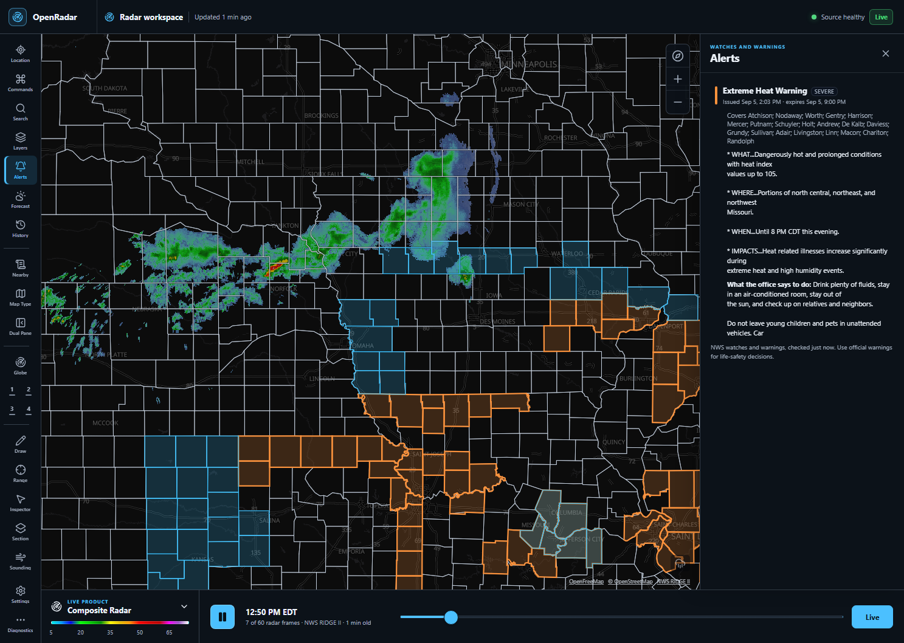

<div align="center">

# OpenRadar

**A desktop weather radar that reads the raw data itself.**

[](https://github.com/SysAdminDoc/OpenRadar/releases)
[](LICENSE)
[](https://github.com/SysAdminDoc/OpenRadar/releases)
[](#how-it-is-put-together)

[Download](#install) · [What it does](#what-it-does) · [Build from source](#build-from-source) · [Where the data comes from](#where-the-data-comes-from)



</div>

---

OpenRadar decodes NEXRAD Level II volumes, MRMS national grids, GOES lightning and GFS wind on your own machine, in Rust, and draws them on a GPU vector map. No account, no API key, no subscription, no ads, and nothing held back behind a paid tier like MyRadar.

It is one window. Pan the planet, zoom from a globe down to a street, and scrub two hours of radar without the map moving under you.

## Why it exists

Good radar on Windows is either a web page that throttles you, or an app that charges by the month for the tilt selector. The data underneath all of it is public: NOAA publishes every Level II volume, every MRMS grid and every warning polygon, free, to anyone who asks.

So OpenRadar asks directly. The Rust side is a decoder, not a wrapper around somebody else's rendering service:

- **Single-site NEXRAD Level II** volumes, unpacked from the archive bucket and drawn as a sweep, with tilt and moment selection.
- **MRMS** GRIB2 grids at one kilometre, including the products that usually cost money: rotation tracks, hail size, echo tops, liquid held aloft, and what kind of precipitation is falling.
- **GOES lightning** from the satellite's own NetCDF files, filtered on the instrument's quality flag.
- **GFS wind** fields, read a field at a time by byte range out of the run index.

Because the decoding happens here, the picture is not a screenshot of somebody's server. Load your own GRLevelX colour tables, keep up to twelve of them, and put one in force per product; the legend rebuilds from whichever is drawing. Set a threshold in dBZ and the gates below it come off the picture.

## What it does

### Radar

- A two-hour NOAA mosaic loop at two-minute steps, with pause, scrub, speed and opacity.
- Past zoom 8 the nearest site that is actually publishing takes over with its own Level II sweep. Tilt, moment, and a hide-below threshold per product.
- Open any local Archive II volume without a network connection, or choose a NEXRAD site and UTC time from NOAA's public archive. Historical volumes keep their own source and time on the timeline, and current warnings stay off the historical picture. The archive search crosses UTC midnight so it does not skip the nearest scan.
- **Live volumes.** The archive object for a volume only lands once the radar has finished sweeping it, which puts the picture four to six minutes behind. Switch on "Volume in progress" and the sector the radar has reached right now is drawn over the last finished sweep, seconds old, with the legend counting the seconds.
- Velocity unfolded before it is drawn, so a wind faster than the radar can measure is not shown blowing the other way.
- Up to six hours of HRRR forecast reflectivity on the tail of the same timeline.
- Automatic failover between sources, with per-source status and a request budget you can watch in Diagnostics.

### Severe weather

- NWS watches and warnings, filtered by hazard rather than by a list of a hundred product names, with damage threat tags drawn heavier and named in the popup.
- **Terminal radars.** The FAA's 47 airport TDWRs, held from the site list. Reflectivity and velocity on three tilts to 48 nautical miles, plus a long range reflectivity to 225, read from their Level III products and drawn exactly like a site's Level II sweep. The panel says which kind of radar you're holding and how far it reaches, and the products the radar doesn't have stay greyed out.
- **Storm cells** from the radar's own tracking algorithm: which blobs are one storm, where each is going, and where it will be in fifteen, thirty, forty-five and sixty minutes. Rotation is ringed.
- **Hydrometeor classification** from the held site's own dual-polarisation algorithm: rain, heavy rain, big drops, ice crystals, dry and wet snow, graupel, and three sizes of hail, read from the lowest tilt or the hybrid scan. The legend names every class and says plainly that it's the radar's reading, not a report from the ground. The inspector names the class under the click.
- **Severe probability** from the National Severe Storms Laboratory model: how likely each storm is to turn severe in the next hour, and separately for hail, wind and a tornado. It is guidance, it draws under the warnings, and it says so.
- Storm reports, SPC convective outlooks and mesoscale discussions.
- Up to ten watched places that speak up when a warning reaches them, wherever the map is pointed, each with its own radius, severity floor, tone and quiet hours. One warning covering several of them is announced once and names them all.

### Beyond the United States

- **Canada** from Environment and Climate Change Canada, on its own rain-rate scale.
- **Germany** from the DWD composite of its seventeen radars, painted in the colours the service publishes it in.
- Alaska, Hawaii, Guam and the Caribbean each get their own MRMS grid rather than falling through to a personal-use feed.

### Tropical

- Cones, forecast tracks, coastal watches and development outlooks, with a storm list you can fly the map to.
- **Storm surge risk**: how far the water could reach for a hurricane of each category, from the National Hurricane Center's own maps.
- **Tides** from the nearest NOAA station, with the next high and low water, because surge rides on top of the tide.
- **Storm history**: every Atlantic and eastern Pacific cyclone since 1851, drawn by intensity, and archive radar replay for the ones since 2003. A replay draws the warnings that were in force at the moment on screen, out of the Iowa State archive, dated so nothing historical reads as live.
- **Replay bundles**: save a replay as one `.orb` file that keeps its frames and the warnings that were in force byte for byte, with every address and SHA-256 in a plain JSON manifest, and open it later to play it back the same with no network. Only the storm's view goes in unless you tick the box to include your workspace, and a bundle's workspace is applied only when you choose to. The layout is four bytes of magic, a version, the manifest, the entries and a whole-file checksum; it's written out in full at the top of `src-tauri/src/bundles.rs`. A damaged or newer file is refused before anything changes. The hashes catch a file that got corrupted on the way, not one somebody rewrote on purpose: every hash is inside the file with the bytes it describes.

### The rest of the sky

- GOES-East GeoColor satellite imagery under the radar, on the same timeline.
- Lightning two ways: the MRMS cloud-to-ground density grid, and GOES total lightning.
- Animated wind particles on the flat map and on the globe.
- Model guidance: what GFS, ECMWF, ICON and GEM each say about the middle of the map, side by side, so you can see where they disagree.

### Working with it

- Seven map styles, flat and globe projection, pitch and bearing, saved views, linked dual panes.
- Draw, range and point inspection tools. Beam height at the cursor for the sweep on screen.
- **Cross-section**: draw a line between two points and the Level II volume is cut along it, height against distance. Heights no beam passed through stay empty rather than being filled from the nearest cut.
- Per-overlay opacity and a drawing order you choose. Warnings are not in the arrangement, because nothing should be able to put a wildfire perimeter over one.
- **Soundings**, drawn here rather than linked to. A Skew-T log-P chart and a hodograph for the nearest balloon that went up, or for a model column over the middle of the map, with CAPE, CIN, cloud base, shear, freezing level and precipitable water worked out from it. The two are never blended and each says which it is. The parcel assumptions are printed in the panel, because a CAPE without them is a number two programs will disagree about for no visible reason.
- **A warning hands you the layer that explains it**. A flash flood warning offers the rain that has already fallen, a tornado warning offers the wind inside the storm, a snow squall offers what is falling. One button in the warning's own popup, which switches a layer on and changes nothing else, undone in one. Every pairing is in one table, so a hazard with nothing to show is a decision written down rather than a button that never appears.
- **Satellite, in two views**. GeoColor is the daylight picture and goes dark over storm tops at night, which is when a convective forecast most wants to look at them, so the 10.3 micron clean infrared band sits beside it: the temperature of whatever the satellite can see the top of, which reads the same at midnight as at noon. Both from NASA GIBS on the same ten-minute cadence and the same timeline.
- **Go to new warnings**, if you want that. Off unless you turn it on: a warning arriving at a watched place takes the map to it once and says so. Moving the map yourself stops the flight, and leaves the next one alone for twenty seconds, whether you dragged it, used the zoom buttons or panned with the keyboard. It never fires while a picture or a loop is being written.
- **River gauges**, because the rain on the radar is not the flood. Every National Water Prediction Service forecast point near the storm, showing what the river reads now and what the office expects it to reach, coloured by the worse of the two. Nearby points only, from zoom 7 in.
- **Export the readings**, not only the picture. The sweep on screen writes as a CSV with a row per gate, its azimuth, range, latitude, longitude, beam height and value; a grid writes as a single-band float GeoTIFF cut to the view, which QGIS, GDAL, rasterio and ArcGIS open directly. Both land beside a JSON file naming the source, the observed time, the units, the missing-value rule and anything done to the numbers. Colour tables and display thresholds are not applied, because a colour is a lossy account of a number. See [What the data export holds](#what-the-data-export-holds).
- **Export** the view as a picture, or the loop as a video or a GIF, with the time and the credits burned in. The video is encoded as fast as the frames can be drawn rather than recorded in real time. A JSON record lands beside the file naming the source of every frame that reached it. See [What the export record holds](#what-the-export-record-holds).
- **Capture layout** for streaming: one command hides everything you operate and leaves a strip with the time, the map centre, the worst warning in view and the credits, sized to stay readable after a stream has been compressed. Leaving it puts the workspace back as it was.
- **Surface observations.** The airport reports nearest whatever you are looking at, drawn as the station plots people already read: a wind barb pointing into the wind with a feather per ten knots, temperature above the disc and dewpoint below, and the disc filled by how much sky is covered. The raw METAR is in the popup. It appears once you are close enough for the plots not to overlap.
- **Smoke.** NOAA's Hazard Mapping System analysis, drawn by an analyst off satellite imagery once a day, in three densities with the analysis date beside the scale. If today's file is not up yet the layer shows yesterday's and says so.
- **Forecast smoke.** Where the HRRR model expects smoke near the ground to go, an hour at a time along the forecast tail, in µg/m³ on the air quality index steps. Each hour is read straight off NOAA's bucket by byte range, decoded and reprojected here. The legend names the cycle, its lead and its age, and the analysis is hidden while a forecast hour is on screen so the two are never mixed. If the newest cycle isn't up yet the previous one answers, and the legend says so.
- **Route weather**: a drive coloured by the chance of rain at the hour you reach each stretch.
- Place search, map-centred forecasts, shareable `openradar://` links.
- **Imported shapes as a managed set**: up to eight GeoJSON or GRLevelX placefiles on the map at once, each with its own name, switch, opacity and place in the drawing order. Importing a file you already have replaces it rather than adding a second copy. All of them draw under the warnings.
- **Phosphor persistence**, optional, on a live single-site sweep. The last pass fades behind the one the radar is making, with a bright edge where the beam is. The legend says the age of the older half as well as the newer, because a decayed picture is older than an undecayed one. Nothing about the readings changes: it is opacity and only opacity, and with it off the picture is exactly the one it always was.
- **Inspect a gate and get the number**, in the product's own unit, with the time of the sweep it came from. On a composite that is the difference between a reading you can check and a reading with no date on it. A bearing the radar has not swept answers with nothing rather than with the last thing it read.
- **A first launch that says something.** The disc draws itself once, over a map that already works, and stops the moment you touch anything. Above the note about where everything is, one line of what a real station near your opening view is reporting, with its name and the time it was taken, or a plain statement that nothing is falling. It never mentions a hazard. Settings can ask for it again.
- **The weather on the chrome, if you want it.** Off unless you turn it on, and it needs a watched place, because a place you did not choose is not where you are. Rain, snow or fog drawn on the command bar while the station nearest your watched place is reporting it, from that station's own raw report, stopping when the report goes stale. It is the bar's background, so it can never be over the map, and it takes itself off if the window stops keeping up.
- **The season, in the chrome and nowhere else.** Four short windows through the year change the accent and nothing on the map. The window comes from your own clock and the latitude you watch, so it is not six months out south of the equator, and it stands down entirely while a warning is in force where you watch. One line the first time each appears, one switch to end them.
- **A place you named, and one action back to it.** The watched place carries whatever you call it, and that word is what the panel shows and what a warning says when it reaches you. Naming it changes nothing about what is polled. **Home** in Commands brings the camera back from anywhere, the globe included, without touching the projection or the layers. A radar site you have pinned says its call sign, how far it is from home, and whether it is still publishing.
- **The workspace in your own colour, and the data left alone.** Settings carries a colour picker for the accent, and a theme file dropped on the Upload panel goes further. What a theme can reach is a fixed list: surface, border, accent, shadow and heading weight. It cannot reach a reflectivity ramp, a warning outline, a hazard colour or a storm track, and that boundary is a test rather than a promise. A theme file is plain text, one directive per line:

  ```
  OpenRadar theme
  Name: Harbour
  Base: dark
  Accent: #7cc4ff
  Surface: rgba(14, 20, 30, 0.94)
  Shadow: 0 18px 45px rgba(0, 0, 0, 0.4)
  HeadingWeight: 700
  ```

  Directives this build does not know are named in the toast rather than refused. Dark and light stay the built-ins, one action puts the plain workspace back, and a reader who has asked Windows for more contrast gets it whatever a theme says.
- English, Spanish and Canadian French, switched in Settings and applied where you are standing rather than on the next launch. Each translation is written by hand against the English catalogue, and only the one you are reading is downloaded.
- **Nearby weather, in words.** A map canvas has nothing a screen reader can read, so the same three questions get answered as text: which warnings cover a place, which storms the radar is tracking near it, and how far and which way each one is moving. It answers about the map centre or any place you watch, and a warning at a watched place is announced once as it arrives. Open it from Commands. The map itself takes the keyboard: tab to it, then the arrow keys move it and plus and minus zoom, so nothing needs a drag.
- **More contrast, if Windows is set to ask for it.** Every locally drawn picture switches to a scale measured under three kinds of colour blindness, and the bar beside the map is built from whichever scale painted what you are looking at. Warning outlines and storm tracks are stroked heavier. A colour table you loaded yourself is left exactly as you supplied it.
- **An offline last view.** Tiles, radar frames and alert polygons are kept on disk, so a launch with no network opens on the last picture you saw and tells you how old it is.
- **Prepared offline regions.** Settings can turn the current map view and a chosen zoom range into a PMTiles pack. Downloads pause and resume, each finished archive is checked before use and checked again after a restart, and a disk ceiling keeps simultaneous pack writes bounded.

## Install

Download `OpenRadar_<version>_x64-setup.exe` from the [releases page](https://github.com/SysAdminDoc/OpenRadar/releases) and run it. It installs for the current user, so it needs no administrator rights.

Windows will show a SmartScreen warning the first time. The installer is not Authenticode-signed yet, and SmartScreen warns about anything it has not seen before. Choose **More info**, then **Run anyway**. Every release ships a `SHA256SUMS` file if you would rather check the download first:

```powershell
Get-FileHash OpenRadar_0.6.0_x64-setup.exe -Algorithm SHA256
```

Updates are a different matter. OpenRadar checks for them only when you ask it to, from Diagnostics, and an update is signed with the project's own key and refused if the signature does not match. The SmartScreen gap does not extend to what arrives afterwards.

### What a release is named, and installing it without the window

Every release publishes the same five files, and the names do not change between releases. Only the version moves:

| Asset | What it is |
| --- | --- |
| `OpenRadar_<version>_x64-setup.exe` | The installer |
| `OpenRadar_<version>_x64-setup.exe.sig` | Its updater signature |
| `SHA256SUMS` | A hash for each of the other four |
| `latest.json` | The update manifest the app reads |
| `release-metadata.json` | The version, the tag, the commit, and the installer hash |

That is a promise, not a description: `npm run release` refuses to publish a set of assets whose names do not match, so anything built on the pattern outside this repository, a Scoop manifest for instance, keeps working across versions.

The installer is NSIS and installs for the current user, so it needs no elevation. `/S` runs it silently and `/D=` sets the directory, which has to come last and unquoted:

```powershell
.\OpenRadar_0.6.0_x64-setup.exe /S
.\OpenRadar_0.6.0_x64-setup.exe /S /D=C:\Tools\OpenRadar
```

Uninstalling is the same shape. `uninstall.exe` is written beside the app, in `%LOCALAPPDATA%\OpenRadar` by default, and takes `/S` too.

## Which platforms this runs on

Windows x64, and only Windows x64. That is the target the installer is built for, the one every release is tested on, and the one the whole test suite runs against.

Tauri 2 itself runs on macOS and Linux, and nothing in this project is deliberately Windows-only. What is missing is not code, it is evidence: no installer is produced for either, no release has ever been launched on one, and the parts most likely to differ are exactly the parts nobody has checked there. The updater, the file dialog, the custom URI schemes the map fetches its own tiles over, and the paths the cache and the offline packs are written to all behave differently per platform, and none of that has been exercised anywhere but Windows.

So a build on macOS or Linux may well work, and it is untested and unsupported. Concretely, that means:

- A bug that only happens on macOS or Linux is written down and left open, because there is no machine here to reproduce it on. It is not a promise of a fix.
- A patch is welcome, with the evidence a claim of support needs: a locally built installer, a real launch on real hardware, the core flows exercised, and the updater and the file dialog checked.
- Until that exists, the platform badge and the release page say Windows, and nothing else should read as a claim otherwise.

## Reporting something that is wrong

Open **Diagnostics** in the app and press **Copy**, then open an issue and paste the block in with what you did and what you expected. The [issue form](https://github.com/SysAdminDoc/OpenRadar/issues/new/choose) asks for both.

What the block contains: the version, this machine's renderer and platform, which sources answered and what they failed with, what is held on disk, a count of the recent warnings and errors by area, and the last forty log lines. What it does not contain: your watched place, your routes, your account name, or full file paths. Coordinates in the log are rounded to about a kilometre and account names are cut out of paths before anything reaches the clipboard. If where you are is part of the problem, there is a switch beside the Copy button that adds your watched place, still rounded.

None of it is sent anywhere. It goes to the clipboard, and you paste it, having read it.

## Privacy

OpenRadar has no account, telemetry, crash reporting or sync. Settings and logs stay on this machine.

**Your record** is the one file here that writes down where you live, so this says exactly what is in it. It is `journal.jsonl` in the app's data folder, one JSON object per line, and each line holds: the name you gave a place, whether the row is an observation or an event, who said it, when the thing was observed, how it was obtained, and one short line of what it was. Nothing about how you use the app ever goes into it. Nothing goes into it for a place you have not named. It is kept for 400 days or 4 MB, whichever runs out first, oldest first. It never leaves the machine, it is not in the diagnostics report, and Settings shows the whole of it, hands it over as itself, and deletes all of it in one press.

Settings also builds a year out of it, over the last month, season or year, on any date. Every figure is counted off the file, and it states how much of the period the record can actually speak for, so three months of record cannot read as a year. It saves as a picture with the period and the data credits on it, and your own words for where you live only when you ask for them. Nothing in it is ranked or scored.

Open it after a few hours away and it says what the record holds from that time: five lines at most, each with the place and the time it happened, and one line saying nothing happened when nothing did. It is read out of the file, never fetched, so it cannot claim a warning stood somewhere it did not. It waits while a warning is in force where you watch, one press sends it away, and one setting ends it.

Three things open an entry, and all three are the weather rather than you: a warning reaching a place you named, the sky changing at one, and a storm the radar is tracking passing within ten miles of one. That last one sees what the workspace is showing, so it needs the storm cells layer on and it only knows about the site the radar is tuned to. Nothing you do writes a row, and a test holds that by reading the source. Each entry keeps a small picture of the map as it was at the time, in a folder beside the file with a budget of its own of 8 MB, so the oldest pictures go long before the rows do. You can write a sentence on any entry in your own words, edit it later, and delete a single entry or the lot. Saving the record writes several files rather than one blob: the file exactly as it is on disk, the same thing written out for a person to read, and every picture beside them.

Prepared incident packs stay in the app's data folder until you delete them. Workspace backups carry the pack name, bounds, size and hash so the reference survives, but they do not copy the map archive into the backup.

Replay bundles carry the storm's frames, the warnings that were in force, and the view you were looking at when you saved one. The view is in there because the tiles it holds are the tiles that view covers, so a bundle cannot reproduce offline without it. Your workspace, which knows where home is and which places you watch, goes in only when you tick the box, and a bundle's workspace is applied only when you choose to. They are written to your downloads folder and read through the system's file picker, so a bundle never crosses into the page as bytes.

The app sends the information needed to answer a request to fixed public providers. Typed place names and forecast coordinates go to Open-Meteo. Route start and end points go to the FOSSGIS routing service, which is told the app is OpenRadar, and points along that route go to Open-Meteo for the weather check. Map and radar requests go to the sources listed in Diagnostics. Those services receive the request and your IP address. Rust limits the desktop app to its configured hosts.

## Build from source

You will need Node.js 22 or newer, Rust 1.85 or newer, and the [Tauri 2 prerequisites](https://v2.tauri.app/start/prerequisites/).

```powershell
npm install
npm run tauri dev
```

For a browser preview, without any of the local decoding:

```powershell
npm run dev
```

To produce the Windows installer:

```powershell
npm run release
```

The command runs every local check, builds and verifies the signed updater installer, then places the installer, signature, update manifest, commit proof, and checksums in `artifacts/`. Add `-- --publish` to create the matching tag and GitHub release after the verified build. Builds happen on the machine in front of you, never on a runner.

### Checks

```powershell
npm run check        # format, lint, unit tests, type-check, build, bundle budget
npm run test:e2e     # Playwright, headless, at 1024, 1440 and 1920 wide
npm run check:live   # asks every live provider whether it still answers
cargo test --lib     # from src-tauri/
```

The build ends on a size gate. `scripts/bundle-budget.mjs` measures each chunk in `dist`, raw and gzipped, against budgets written down beside them, and fails when one grows past its budget. The main chunk is 77 per cent MapLibre GL and React DOM by module bytes, both on the path to the first interactive map, so there is nothing to split out of it that would not put the map behind a second download; the panels, the export encoders and the storm archive already load only when a reader opens them. `node scripts/bundle-report.mjs` says what is inside a chunk when the gate trips, and `--detail` breaks the app's own files out one by one.

The normal gate never touches the network. `npm run check:live` is the one that does: it walks every provider this app reads, in both the browser and the native half, spaced out so it stays a check rather than a small flood, and prints whether each one passed, failed, or was skipped. Add `-- --json` for the machine-readable form, or `-- --only=mrms` for a single source. It exits non-zero only when a source a release depends on is genuinely broken, and it refuses to run on shared build infrastructure, because these are public services that owe this project nothing.

The Rust suite has a second half that reaches the live NOAA buckets and is skipped by default. `npm run check:live` runs it for you, and `cargo test --lib -- --ignored` runs it directly when you want the full output.

### Fuzzing the decoders

Every binary format this app reads arrives from a public server, and none of it is a format you get to choose. Level II, GRIB2 in two packings decoded here by hand, and NetCDF-4 on top of HDF5. The bug worth finding is not a wrong picture, it is a panic or an unbounded allocation in length arithmetic reached from bytes somebody else sent, which in an app that fetches on a timer is a remote denial of service.

`src-tauri/fuzz` holds one target per entry point: `level2_volume`, `grib_message`, `grib_complex`, `mrms_grib`, `level3_message` and `netcdf_flashes`. They need a nightly toolchain and the Visual Studio AddressSanitizer component, which the C++ build tools install as `clang_rt.asan_dynamic-x86_64`:

```powershell
rustup toolchain install nightly
cargo install cargo-fuzz
cd src-tauri
cargo +nightly fuzz build                             # all six
cargo +nightly fuzz run mrms_grib -- -max_total_time=3600 -rss_limit_mb=4096
```

Give the memory ceiling room. An AddressSanitizer process grows with its
execution count rather than with any one input, so the stock 2048 is tripped by
a long session and libFuzzer saves whatever happened to be running: an artifact
that replays clean in a fresh process. Removing the ceiling is worse. Five
unbounded targets at once exhausted the machine's commit limit and every one of
them died on an allocation of a few hundred kilobytes, which reads exactly like
a real finding and is not. Replay any artifact in a fresh process before
believing it.

Seeds are committed under `fuzz/seeds`, written by two ignored tests that build them from the same fixtures the unit tests use, so they can be rebuilt when a fixture changes. Copy them into `fuzz/corpus/<target>` before a session; that directory is where libFuzzer grows its own corpus and is not committed, because the seeds are what is worth keeping and a hundred thousand mutations are not.

```powershell
cargo test --lib writes_the_fuzz_seed_corpus -- --ignored
```

Anything a target finds is committed as a reproducer and turned into an ordinary unit test **before** it is fixed, so the fix is proved rather than assumed and the case is checked on every run afterwards.

An hour on each of the five decoder targets on 2026-09-01 came to about 584
million executions and found nothing: 459 million on `grib_message`, 50 million
on `grib_complex`, 43 million on `level2_volume`, 25 million on
`level3_message` and 7 million on `mrms_grib`. `netcdf_flashes` is the
exception and is not in that number. It found two defects in the first minutes
of its first session, one guarded here and one an unbounded recursion inside
the reader that nothing outside it can contain; both sets of bytes are
committed and both are checked on every test run, and the second is written up
as an upstream problem rather than pretended to be fixed.

The half of this that does not need nightly runs in the ordinary gate: `gfs::tests::complex_packing_holds_its_shape_on_arbitrary_input` shapes four thousand seeds into complex-packing headers, half of them moved into the set the decoder accepts so the differencing behind the guards is actually reached, and holds two rules on every one: no input reaches a panic, and a field that decodes holds exactly the number of points its own header claimed.

## How it is put together

Tauri 2 shell, React 19 and TypeScript in the window, MapLibre GL for the map, and Rust for everything that has to read a binary format. Decoded products reach the map through registered URI schemes, so a grid decoded on your machine is an ordinary tile source rather than a special case in the timeline. Every native fetch goes through one host allowlist. Short-lived responses use a bounded cache; prepared PMTiles packs use a separate durable store so clearing ordinary cache data cannot erase them.

There is more detail in [docs/architecture.md](docs/architecture.md), and the changelog is in [CHANGELOG.md](CHANGELOG.md).

## Where the data comes from

Everything OpenRadar draws is public data, and every source below is credited in the app as well as here.

| What               | Source                                                                                |
| ------------------ | ------------------------------------------------------------------------------------- |
| Radar mosaic       | NWS RIDGE II, with NOAA nowCOAST behind it                                            |
| National grids     | NOAA MRMS open data on AWS, decoded locally                                           |
| Single-site radar  | NEXRAD Level II from the Unidata archive and real-time chunk buckets, decoded locally |
| Forecast radar     | HRRR reflectivity via Iowa State Mesonet                                              |
| Canadian radar     | Environment and Climate Change Canada, GeoMet                                         |
| German radar       | Deutscher Wetterdienst GeoServer                                                      |
| Satellite          | GOES-East GeoColor through NASA GIBS                                                  |
| Lightning          | GOES-19 Geostationary Lightning Mapper on AWS                                         |
| Wind               | NOAA GFS open data on AWS                                                             |
| Warnings           | NWS event-driven map service                                                          |
| Severe probability | NSSL ProbSevere                                                                       |
| Tropical           | National Hurricane Center map service, HURDAT2 best track                             |
| Tides              | NOAA CO-OPS                                                                           |
| Earthquakes        | USGS                                                                                  |
| Wildfires          | NIFC                                                                                  |
| Basemap            | OpenStreetMap via OpenFreeMap; USGS imagery and The National Map Topo; OpenTopoMap    |
| Road routing       | FOSSGIS public Valhalla, on OpenStreetMap data                                        |
| Fallback radar     | RainViewer, only where the NOAA mosaics do not reach                                  |

We acknowledge the use of imagery provided by services from NASA's Global Imagery Browse Services (GIBS), part of NASA's Earth Science Data and Information System (ESDIS).

RainViewer is licensed for personal and small community use, which is why it sits at the end of the chain rather than in front of it.

### What the export record holds

A caption has room for a time and a credit, which is enough to know what you are looking at and not enough to check it. So every export writes a second file next to the picture, named after it: `openradar-loop-2026-08-31T18-04-11-provenance.json` beside `openradar-loop-2026-08-31T18-04-11.webm`.

It is plain JSON with a `format` of `openradar-provenance` and a `formatVersion` of `1`. The version only moves if the shape changes in a way that would break a reader.

```json
{
  "format": "openradar-provenance",
  "formatVersion": 1,
  "application": "OpenRadar 0.6.0",
  "writtenAt": "2026-08-31T18:04:12.318Z",
  "picture": "openradar-loop-2026-08-31T18-04-11.webm",
  "basemap": "OpenStreetMap",
  "frames": [
    {
      "index": 0,
      "sourceId": "mrms",
      "label": "MRMS",
      "attribution": "NOAA MRMS",
      "attributionUrl": "https://www.nssl.noaa.gov/projects/mrms/",
      "kind": "observation",
      "observed": "2026-08-31T18:00:00.000Z",
      "valid": "2026-08-31T18:00:00.000Z",
      "fetched": "2026-08-31T18:03:57.001Z",
      "freshForMs": 240000,
      "cachedAgeSeconds": null
    }
  ]
}
```

One entry per frame that reached the file, in timeline order. A loop is not one source: its observed frames and its forecast tail come from different services, and a GIF holds only the last two dozen frames, so a single record for the whole file would be wrong for most of it.

`basemap` is the credit for the map under the weather, and it follows the style that was on screen: five of the eight are OpenStreetMap data by way of OpenFreeMap, aerial is USGS orthoimagery, topography is OpenTopoMap's own exact line, and a picture drawn over a prepared incident pack credits the pack. It is the same string the map's attribution bar shows and the same one burned into the corner.

`fetched` is when those bytes reached the machine, not when the file was written, so an export made an hour after the last refresh says so. `freshForMs` is how long the source's own publishing cadence says a frame stays current, worked out from the gap between the frames on the timeline.

`kind` is `observation`, `forecast` or `derived`, and it decides the rest. A forecast has no `observed` time, because nothing measured it; it carries a `modelRun` with the run's `initUtc` and `leadMinutes`, or `runUnknown` when the source will not say which run it used. A `derived` frame carries `derivedFrom` saying what was done to the values. `cachedAgeSeconds` is null when the bytes came off the network and a number when the disk cache served them, which is what separates a current picture from one that survived an outage.

The times are ISO strings rather than the milliseconds the app uses internally, because a file outlives the program that wrote it and a number with no units is a guess.

### What the data export holds

A picture answers "what did it look like". The data export answers "what did it measure", which is the one you can put next to a rain gauge or into a case study.

Two files land each time: the data, and a `.provenance.json` beside it with the same name. The sidecar is plain JSON with a `format` of `openradar-data-provenance`.

```json
{
  "format": "openradar-data-provenance",
  "formatVersion": 1,
  "application": "OpenRadar 0.6.0",
  "writtenAt": "2026-09-02T18:44:03Z",
  "dataFile": "openradar-kdmx-reflectivity-20260901-173211.csv",
  "sha256": "9f2c…",
  "kind": "polar",
  "product": { "id": "reflectivity", "label": "Reflectivity", "unit": "dBZ" },
  "observed": "2026-09-01T17:32:11Z",
  "source": {
    "kind": "archive",
    "label": "NOAA NEXRAD Level II archive",
    "url": "https://registry.opendata.aws/noaa-nexrad/"
  },
  "geometry": {
    "station": "KDMX",
    "siteLatitude": 41.7311,
    "siteLongitude": -93.7228,
    "elevationDegrees": 0.48,
    "azimuthCount": 720,
    "gateCount": 1832,
    "firstGateRangeKm": 2.125,
    "gateIntervalKm": 0.25,
    "beamModel": "4/3 effective earth radius"
  },
  "coordinateReference": "EPSG:4326",
  "derivation": [],
  "missing": "gates below the detection threshold and gates with no data are omitted; a range folded gate has an empty value and status rangeFolded"
}
```

A **sweep** is a fan of gates rather than a raster, so it goes out as CSV. Putting it on a grid would mean resampling, which is the loss the export exists to avoid. The header repeats the geometry as comment lines so the file stands on its own, and the columns are `azimuth_index`, `gate_index`, `azimuth_deg`, `range_km`, `latitude`, `longitude`, `height_m`, `value`, `status`. Gates that measured nothing are left out and counted in the header, so a file is the size of the storm rather than the size of the disc. A range folded gate is written with an empty value and its status, because an ambiguous velocity is a measurement and not an absence.

A **grid** goes out as an uncompressed single-band float32 GeoTIFF, tagged EPSG:4326 with `ModelPixelScale`, `ModelTiepoint` and a `GeoKeyDirectory`. It is clipped to the grid's own extent rather than padded out to the view, so a view hanging off the edge of the country writes the part that exists. The values are as decoded, including the codes MRMS reserves for missing (-999) and for no radar coverage (-99), because rewriting those would be inventing data; an empty cell would be NaN, and `GDAL_NODATA` says so.

`derivation` is the one thing that changes the numbers. Unfolded velocity and a subtracted storm motion are recorded there; a colour table, the high contrast ramps and a display threshold are not applied at all, so they never appear.

## Not a warning source

OpenRadar is a viewer for public data and nothing more. It is not an official source for warnings, and it is not something to make a life-safety decision on. When the weather is dangerous, listen to your local National Weather Service office, a NOAA Weather Radio, or whatever your country's equivalent is.

## Reporting a security problem

Use GitHub's private vulnerability reporting on this repository, from the Security tab. [SECURITY.md](SECURITY.md) covers which versions get fixes, what to expect after you send something, and the boundaries worth knowing about before you go looking.

## Licence

[MIT](LICENSE).
